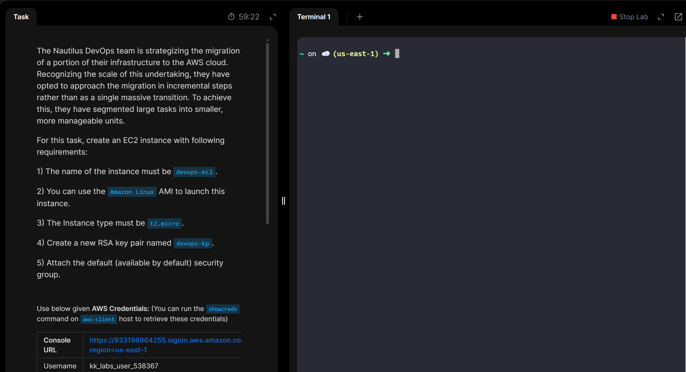

# Day 5 - Launch EC2 Instance

## 🔍 Objective
Create a EC2 instance and also ,key pair creating with giving basic understanding on EC2 instance

Goal:
The goal of this task is to understand about EC2 instance Launch

---

## 🛠️ Services / Tools Used
- AWS EC2
- AWS Management Console

---

## 📋 Steps Performed
1. loged into AWS management console using temporary user name and password privided in challenge task  
2. Direct to EC2 service and select the Instance  create new EC2 instance with using details provided in the excercise 
4.  Finished the excercise 

---

## 📸 Evidence / Artifacts
- Console screenshots
 	   - Read the question
     

    
    
 
       - Direct to EC2 service 
    

    
    

      - Select the Launch Ec2 instance 
    

    
	
    
    
    - Create a key value pair
    

    
    

    - Select default VPC/secury group
    

    
	
    

     - Completion the EC2 creation
    

    
    
    
	- Completion the Task
    

    
    
    
---

## ✅ Outcome / What I Learned
- How to create a EC2 instance
  

---

## 🧠 Key Takeaways

- 🌐 AWS EC2

	-Amazon EC2 = virtual servers you can launch on demand in Amazon Web Services

	-Provides full control of OS and is scalable (manual or Auto Scaling)

	-Pay only for what you use (On-Demand, Reserved, Spot)

